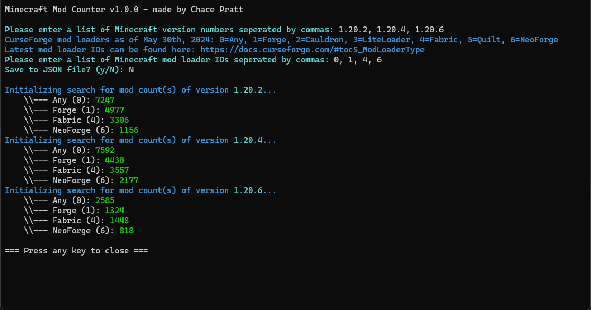

# Minecraft Mod Counter
## A simple Rust console application that counts the amount of Minecraft mods published to CurseForge

### Features
- Output count(s) to a file
- Get count(s) for specific mod loaders
- Get count(s) for specific Minecraft versions

### Screenshot

### How to Use
- **Note: you will need a CurseForge API key to use this program (you can create one here: [CurseForge for Studios Console](https://console.curseforge.com/))**
- Download the latest executable from the releases tab (or build it yourself) and place it into a folder
- Inside that same folder, create a file called "apikey.txt" and copy your CurseForge API key into it
- Run the program and it will guide you from there

### Why?
I made this program because whenever I update my Minecraft mods, I pick different versions of Minecraft to update to based on how many other mod creators have updated their mods to each version of Minecraft. It's also kinda cool to see how many mods have been published to CurseForge for each version of Minecraft.